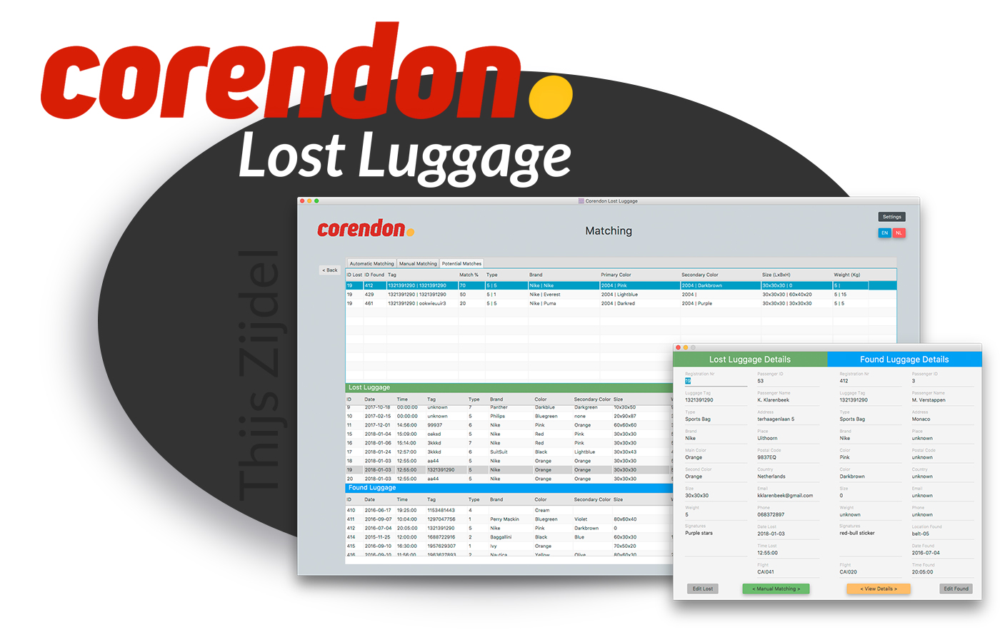

# Corendon-LostLuggage

Java Application for automating the process of retrieving lost luggage for the airline company Corendon.




## Getting Started

To see the application there are some things that needs to be configured before running it.
So please follow to following document or read /doc/manual.pdf

Note: we didn't received a requirement from Corendon to make it a runable jar and add a config file.


### Prerequisites

Install a Java IDE to build and run the application

```
We used Netbeans to build it. See [Built with] for the link
```

Install and configure an SQL host.

```
We used SQL Workbench's local host to run our database
```


### Installing

When you have an SQL Host and IDE installed (prefered Netbeans) u can follow these steps:

Step 1) Creating the database.

```
Run the CreateDB.sql file in your sql host.
```

Step 2) Configuring the connection.

```
Go to the MainApp.java (in /app/..) and edit line: 50

Keep the first  parameter the same. 
Change the second parameter to your SQL userName.
Change the third  parameter to your SQL userPassword.
```


Step 3) Run the application.

```
For getting the user passwords see: /doc/manual.pdf 
```


### More information

See: /doc/manual.pdf 
For the entire installation and configuring process and a full manual of the application.


## Built With

* [MySQL](https://www.mysql.com/) - For the database of the application
* [Java](https://www.java.com/) - The langauge that we build our application in.
* [Netbeans](https://netbeans.org/) - In what we developed the application.
* [Scenebuilder](http://gluonhq.com/products/scene-builder/) - For building the application scene's.
* [Maven](https://maven.apache.org/) - Dependency Management

### Dependencies/ Libraries 
* [JFoenix](http://www.jfoenix.com/) - For the material design in the application
* [SQL Connector](http://www.jfoenix.com/) - For the connection to the database (MYJbdc)


## Built By

* **Thijs Zijdel** 
* **Michael de Boer** 
* **Arthur Krom**
* **Daron Ozdemir**


## Project Files
- app/LostLuggage			(folder for application)
	- /paths/ 				(for info, send me a message)				

- data 						(folder for db dummy data)
	- CreateDB.sql 			(sql create dummy database query)


- doc 						(folder for documentation)
	- Manual.pdf 			(full manual, inc. installation)
  	- Poster.png  			(for giving an impression of the app)
   	- Responsibilities.pdf 	(responsibilities for each author)
		

## License

This project is licensed under the MIT License - look at [LICENSE.md](LICENSE.md) file for details.